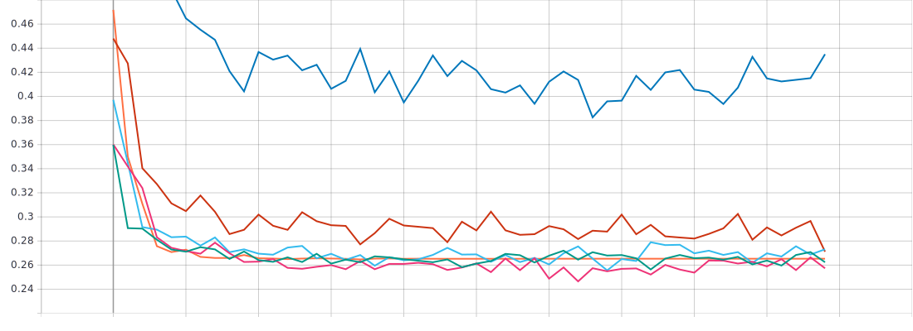
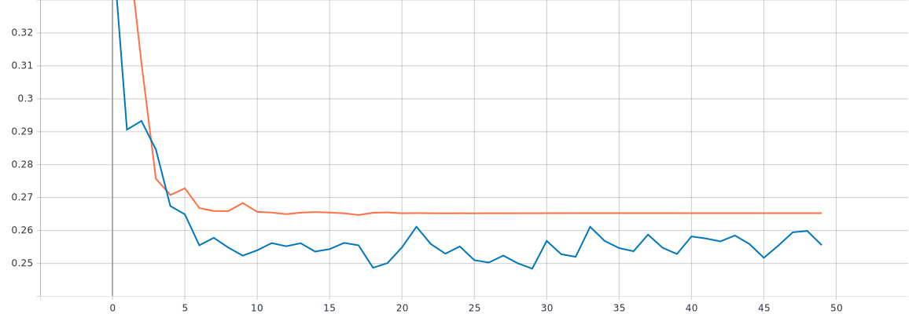

# Исследование влияния различных техник аугментации данных на процесс обучения нейронной сети на примере решения задачи классификации Oregon Wildlife с использованием техники обучения Transfer Learning
Аугментация данных предполагает увеличение выборки данных для обучения через модификацию существующих данных. Таким образом будут вносится изменения в искомый датасет Oregon Wildlife для большего разнообразия и увеличения количества изображений в нем. В данной лабораторной работе будут использоваться следующие техники аугментации данных:  
+ Манипуляции с яркостью и контрастом  
+ Поворот изображения на случайный угол  
+ Использование случайной части изображения  
+ Добавление случайного шума  
В данной лабораторной работе для решения задачи классификации изображений Oregon Wildlife использовалась нейронная сеть EfficientNet-B0, причем данная нейронная сеть будет иметь уже предобученные веса на базе изображений ImageNet. В качестве политики изменения темпа обучения была использована политика экспоненциального затухания с оптимальными параметрами initial_lrate = 0.01 и k = 0.3 (initial_lrate - начальный темп обучения, k - коэффициент наклона экспоненциальной кривой).  
## С использованием техники обучения Transfer Learning и оптимальной политики изменения темпа обучения обучить нейронную сеть EfficientNet-B0 (предварительно обученную на базе изображений imagenet) для решения задачи классификации изображений Oregon Wildlife с использованием следующих техник аугментации данных:
### 1. Манипуляции с яркостью и контрастом  
Данная техника аугментации данных предполагает изменение яркости и контрастности изображения. Для изменения контрастности использовалась следующая функция: 
```
tf.image.adjust_contrast(images, contrast_factor)
```
images - входное изображение (размер 224x224x3).  
contrast_factor - множитель для регулировки контраста.
```
def contrast(image, label):  
  return tf.image.adjust_contrast(image, 2), label
```  
Для изменения якрости использовалась следующая функция:  
```
tf.image.adjust_brightness(image, delta)
```
image - входное изображение (размер 224x224x3).    
delta - число добавляемое к значениям пикселей.
```
def brightness(image, label):  
  return tf.image.adjust_brightness(image, delta=0.3), label  
```
### Нахождение оптимальных параметров для манипуляции с яркостью и контрастом:  
Для нахождения оптимальных параметров, были проведены обучения с различными параметрами, такими как (contrast_factor - множитель для регулировки контраста, delta - число добавляемое к значениям пикселей для изменения якрости):  
+ contrast_factor = 2, delta = 0.3  
+ contrast_factor = 1, delta = 0.3  
+ contrast_factor = 0.5, delta = 0.5  
+ contrast_factor = 1, delta = 0.1  
+ contrast_factor = 3, delta = 0.1  
+ contrast_factor = 2, delta = 0.1  
#### В результате получили следующие графики в сравнении с политикой экспоненциального затухания с оптимальными параметрами initial_lrate = 0.01 и k = 0.3 без аугментации данных:  
+ График метрики точности для предобученной нейронной сети EfficientNet-B0 (манипуляция с яркостью и контрастом) для валидационного набора данных:

  


* График функции потерь для предобученной нейронной сети EfficientNet-B0 (манипуляция с яркостью и контрастом) для валидационного набора данных:  

  
 


* Анализ полученных результатов  
### 2. Поворот изображения на случайный угол  
Для поворота изображения на случайный угол был добавлен следующий слой: 
```
rot_img = tf.keras.layers.experimental.preprocessing.RandomRotation(factor = 0.02, fill_mode = 'reflect')(inputs)
```
factor - параметр, определяющий нижнюю и верхнюю границу для вращения по и против часовой стрелки. В данном случе случайный угол вращения будет выбран из диапазона [-7.2, 7.2] градусов (положительные значения означают вращение против часовой стрелки, а отрицательные - по часовой стрелке)  
inputs - входное изображение (224x224x3).  
fill_mode - режим заполнения (reflect - означает, что входное изображение будет отражено по горизонтали)  
### Нахождение оптимальных параметров для поворота изображения на случайный угол:  
Для нахождения оптимальных параметров, были проведены обучения с различными параметрами, такими как (factor - параметр, определяющий диапазон из которого будет случайно выбран угол поворота, fill_mode - режим заполнения, k - коэффициент наклона экспоненциальной кривой):  
+ factor = 0.0, 0.02, fill_mode = 'reflect', k = 0.5 
+ factor = 0.0, 0.02, k = 0.3  
+ factor = 0.02, k = 0.3  
+ factor = 0.02, k = 0.5  
+ factor = 0.02, k = 0.7    
+ factor = 0.05, k = 0.5  
+ factor = 0.0, 0.5, k = 0.3  
+ factor = 0.0, 0.125, k = 0.3  
#### В результате получили следующие графики в сравнении с политикой экспоненциального затухания с оптимальными параметрами initial_lrate = 0.01 и k = 0.3 без аугментации данных:  
+ График метрики точности для предобученной нейронной сети EfficientNet-B0 (поворот изображения на случайный угол) для валидационного набора данных :

  

  

  


    

* График функции потерь для предобученной нейронной сети EfficientNet-B0 (поворот изображения на случйный угол) для валидационного набора данных:  

  

  

  


  

* Анализ полученных результатов  
### 3. Использование случайной части изображения  
Для использования случайной части изображения были добавлены следующие слои:  
```
x = tf.keras.layers.experimental.preprocessing.Resizing(235,235)(inputs)  
x = tf.keras.layers.experimental.preprocessing.RandomCrop(224,224)(x)  
```
Первый слой ``Resizing`` необходим для того, чтобы масштабировать наше изображение (224x224) до больших размеров (235x235). А затем к этому мастабированному изображению применяется слой ```RandomCrop``` для обрезки случайной части размером 224x224 из масштабированного изображения размером 235x235.  
Так как нейронная сеть EfficientNet-B0 требует подавать на вход изображение размером 224x224, то в данном случае параметры ```RandomCrop``` меняться не будут, а будут меняться параметры для ```Resizing``` (масштабирование), а именно высота (height) и ширина (width), которые будут у выходного изображения после применения этого слоя:  
+ height = 448, width = 448  
+ height = 300, width = 300  
+ height = 275, width = 275  
+ height = 250, width = 250  
+ height = 235, width = 235  
#### В результате получили следующие графики в сравнении с политикой экспоненциального затухания с оптимальными параметрами initial_lrate = 0.01 и k = 0.3 без аугментации данных:  
+ График метрики точности для предобученной нейронной сети EfficientNet-B0 (использование случайной части изображения) для валидационного набора данных:

  
 


* График функции потерь для предобученной нейронной сети EfficientNet-B0 (использование случайной части изображения) для валидационного набора данных:  

  



* Анализ полученных результатов  
### 4. Добавление случайного шума  
Для добавления случайного шума к изображению, был добавлен следующий слой: 
```
x = tf.keras.layers.GaussianNoise(stddev = 0.6)(inputs)  
```
inputs - входное изображение (224x224)  
stddev - значение среднеквадратичного отклонения добавляемого шума
### Нахождение оптимальных параметров для добавления случайного шума:  
Для нахождения оптимальных параметров, были проведены обучения с различными параметрами, такими как (stddev - значение среднеквадратичного отклонения добавляемого шума):  
+ stddev = 0.1  
+ stddev = 0.3  
+ stddev = 0.6  
+ stddev = 1.0  
+ stddev = 1.3  
#### В результате получили следующие графики в сравнении с политикой экспоненциального затухания с оптимальными параметрами initial_lrate = 0.01 и k = 0.3 без аугментации данных:  
+ График метрики точности для предобученной нейронной сети EfficientNet-B0 (добавление случайного шума) для валидационного набора данных:

  

  

* График функции потерь для предобученной нейронной сети EfficientNet-B0 (добавление случайного шума) для валидационного набора данных:  

  

  

* Анализ полученных результатов  
## Использование исследованных техник аугментации данных совместно  
В данной части лабораторной работы были использованы все вышеперечисленные техники аугментации данных совместно. Для каждой техники были использованы оптимальные параметры, а именно:
+ Манипуляции с яркостью и контрастом
  + contrast_factor = 2, delta = 0.3  
+ Поворот изображения на случайный угол 
  + factor = 0.02, k = 0.3 
+ Использование случайной части изображения  
  + height = 250, width = 250
+ Добавление случайного шума  
  + stddev = 0.6 
#### В результате получили следующие графики в сравнении с политикой экспоненциального затухания с оптимальными параметрами initial_lrate = 0.01 и k = 0.3 без аугментации данных:  
+ График метрики точности для предобученной нейронной сети EfficientNet-B0 (использование исследованных техник аугментации данных совместно) для валидационного набора данных:


  

* График функции потерь для предобученной нейронной сети EfficientNet-B0 (использование исследованных техник аугментации данных совместно) для валидационного набора данных:  

  
 
  

* Анализ полученных результатов
